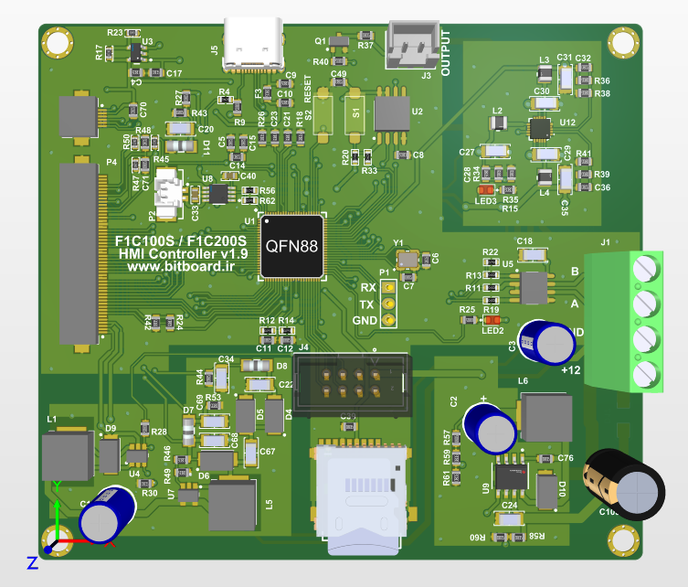

# Allwinner F1C200s Development Board

This is a lightweight yet powerful development board based on the **Allwinner F1C200s** SoC — a low-power ARM926EJ-S processor with an integrated 2D GPU. Designed for **graphical user interfaces (GUI)**, **multimedia playback**, and **embedded control systems**, the board offers a compact platform for embedded Linux development.

---

  

---

## ⚙️ Key Features

- **SoC**: Allwinner F1C200s  
  - CPU: ARM926EJ-S @ 533 MHz  
  - Integrated 2D Graphics Engine  
  - 64MB built-in DDR RAM  
- **Flash Memory**: 16MB SPI NOR Flash (W25Q128)
- **Power Supply**: 7–35V DC input (with onboard regulator)
- **USB**: USB Type-C port for power and communication
- **Display Support**:
  - 50-pin FPC connector for LCD up to 1280×720
  - 6-pin FPC connector for capacitive touch (GT911 via I2C)
- **Storage**:
  - microSD card slot (4-bit SDIO interface)
- **Connectivity**:
  - RS485 port with TVS protection for industrial applications
- **User Interface**:
  - Boot and Reset buttons
  - Logic-level MOSFET output for external loads (e.g. LED, buzzer, relay)

---
